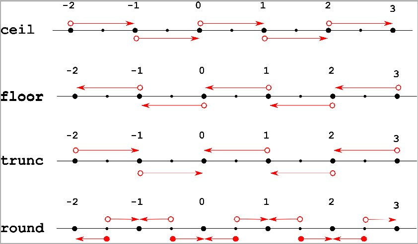

# BigQuery

# WebUI

## キーボードショートカット

Mac の場合は Ctrl の代わりに Cmd にする

|キー|アクション|
|----|----|
|Ctrl Enter|現在のクエリを実行|
|Tab|現在の単語をオートコンプリート|
|選択 Tab|選択範囲のインデントを上げる|
|選択 Shift Tab|選択範囲のインデントを下げる|
|Ctrl|テーブル名をハイライト表示|
|Ctrl テーブル名をクリック|テーブル スキーマを開く|
|Ctrl E|選択項目からクエリを実行|
|Ctrl /|選択行をコメントアウト|
|Ctrl Shift F|クエリを書式設定|

[Web IU のキーボードショートカット](https://cloud.google.com/bigquery/docs/bigquery-web-ui#keyboard_shortcuts)


# SQL

## レギュラーSQLをデフォルトにする

クエリの前に `#standardSQL` の記述を追加する。逆にレガシーにしたい場合は `#legacySQL` を記述する。


```{sql}
#standardSQL
SELECT
  weight_pounds, state, year, gestation_weeks
FROM
  `bigquery-public-data.samples.natality`
ORDER BY weight_pounds DESC
LIMIT 10;
```

`.bigqueryrc` に以下を記述

```
[query]
--use_legacy_sql=false

[mk]
--use_legacy_sql=false
```

## 基本文法

- [標準SQLの演算子](https://cloud.google.com/bigquery/docs/reference/standard-sql/operators?hl=ja)
- [標準SQLの関数と演算子](https://cloud.google.com/bigquery/docs/reference/standard-sql/functions-and-operators?hl=ja)

### 実数を丸める関数

- `ROUND()`
- `CEILING()`
- `FLOOR()`
- `TRUNC()`

[丸め関数の挙動](https://cloud.google.com/bigquery/docs/reference/standard-sql/functions-and-operators?hl=ja#floor)




### 行の抽出

#### WHERE column IN( sub_query )

列の値が、サブクエリの出力結果と同じ値をもつ行だけを抽出する

```
SELECT
  *
FROM
  tableA
WHERE
  item IN (
    SELECT
      product
    FROM
      tableB
  )
```

#### WHERE EXISTS( sub_query )

サブクエリのなかのwhere句で抽出したいレコードの条件を指定する。

```
SELECT
  *
FROM
  tableA
WHERE
  EXISTS (
    SELECT
      product
    FROM
      tableB
    WHERE
      tableA.item = tableB.product
      AND tableA.price = tableB.price
  )
```


# bq コマンド

## Data set を作成する

```
bq mk \
--dataset \
--location=US \
--default_table_expiration 3600 \
--default_partition_expiration 3600 \
--description 'description' \
project_id:dataset_name
```

- `location` US など
- `default_table_expiration` テーブル自動削除までの秒数を指定する、デフォルトでは 3600 、0に設定すると自動削除しない
- `default_partition_expiration` テーブルに対するパーティションの自動削除までの秒数
- `description` データセットの説明、`'` か `"` で括る
- `project_id:dataset_name` プロジェクトIDと、作成するデータセットの名前

## クエリを実行する

```
 bq query
```